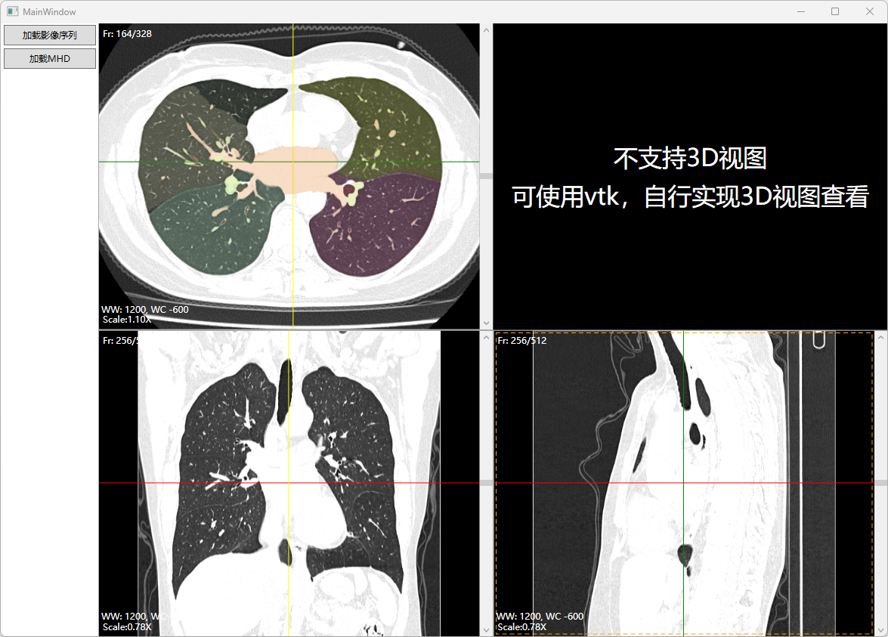

# WPF Medical View

使用WPF实现的医疗影像查看器

## 截图

 

* 备注：暂时未实现3D模块

## 功能

* [x] DICOM影像查看
* [x] MPR切面重建
* [x] 窗宽窗位调节
* [x] 缩放和平移
* [x] MHD模型在轴状位的MASK蒙层

## 开发环境

- Windows11
- Visual Studio 2022

## 依赖库

- [fo-dicom](https://github.com/fo-dicom/fo-dicom)
- [SimpleITK](https://github.com/SimpleITK/SimpleITK)
- [Common.Logging](https://github.com/net-commons/common-logging)

## 快速开始

- 安装 [SimpleITK](https://github.com/SimpleITK/SimpleITK/releases/tag/v2.3.1)，当前版本 `v2.3.1` 安装目录 `C:\Programs\SimpleITK-2.3.1\x64`
